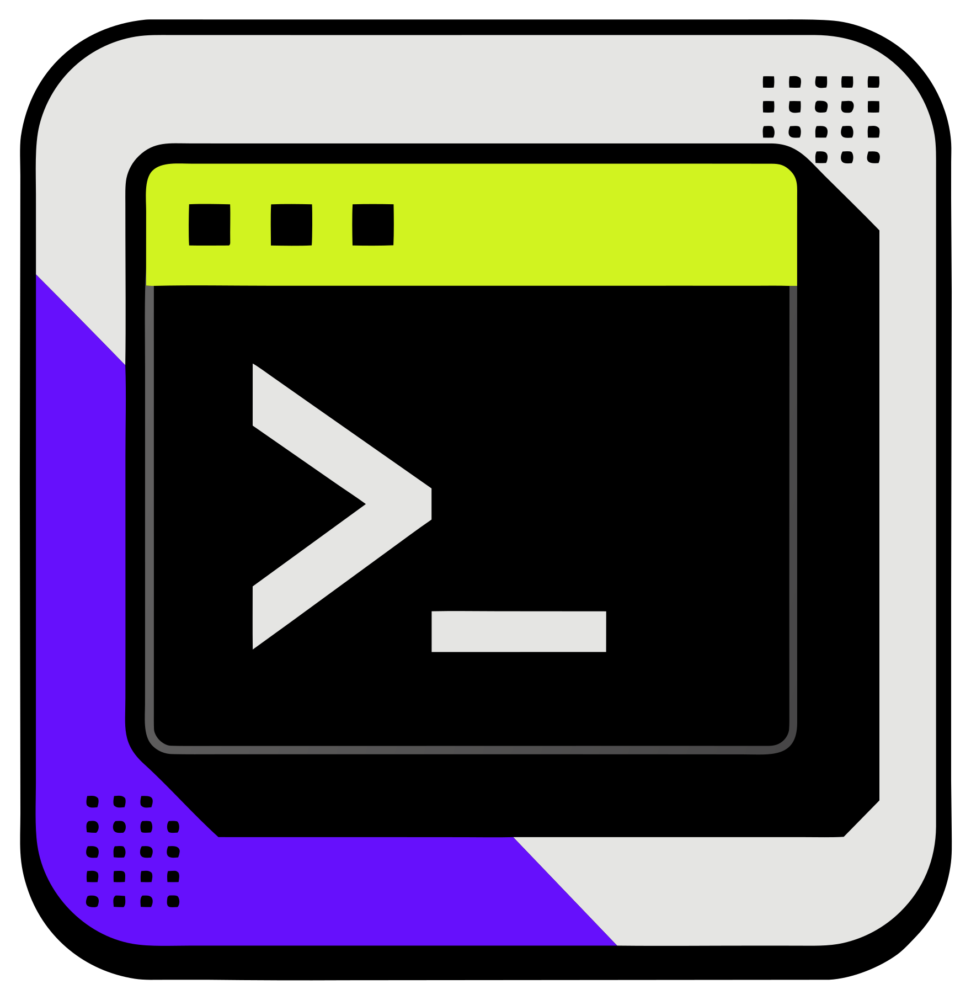
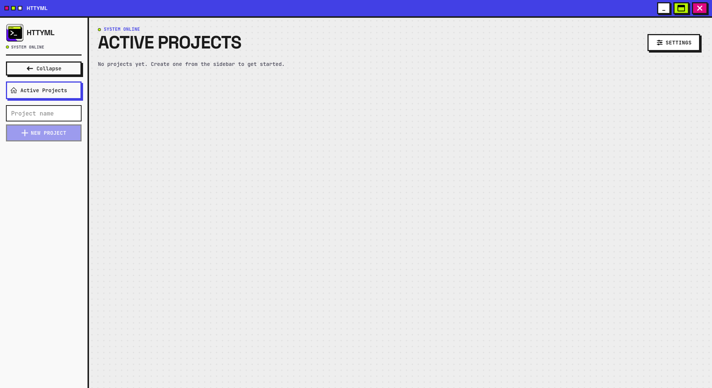
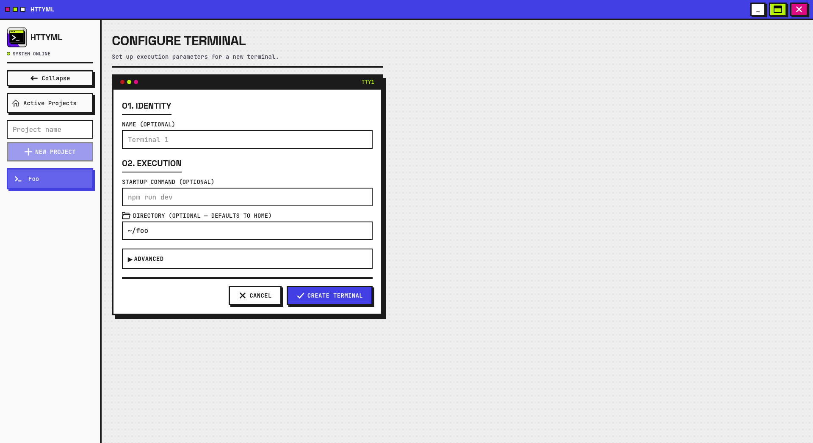
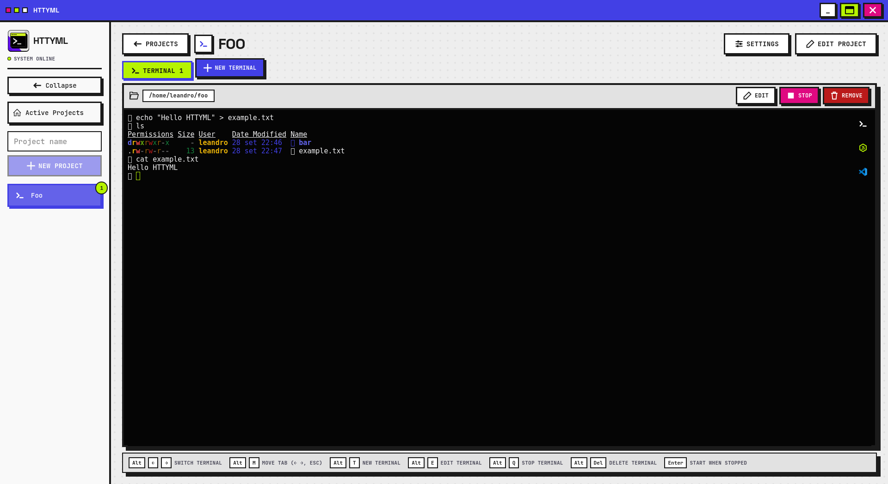
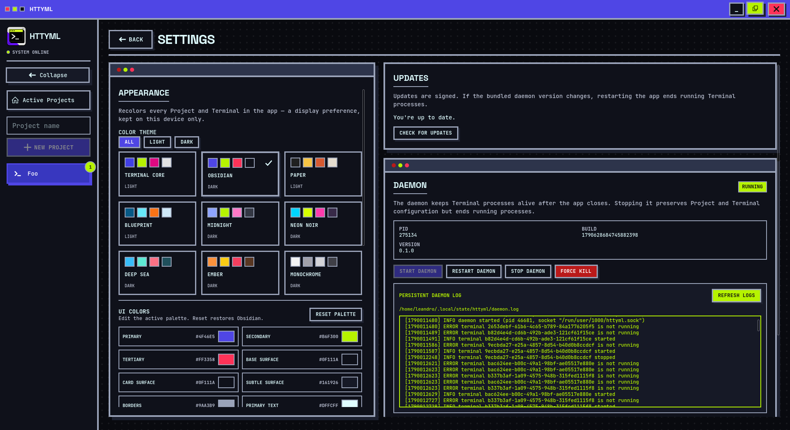

<p align="center">
  
</p>

# HTTYML

**Persistent local terminals, organized around your projects.**

HTTYML is a Linux desktop app for keeping the terminals you use for development in one place. Create a Project, give each Terminal its own working directory and commands, and return to your work after closing the app. A separate Daemon keeps Terminal processes running until they exit or you stop them.

[](https://github.com/Leandro-C-Reis/httyml/releases/latest)


## Why I built it

> I built HTTYML because I needed a simpler way to manage my terminals. I tried tmux, Alacritty + Zellij, and other setups, but none of them suited my workflow. They are great tools, just not the right fit for how I like to work, so I created my own.

I wanted a visual way to group the terminals I use for a project, set each one up once, and leave long-running commands alone when I close the window. HTTYML is built around that workflow. It manages local shell processes directly, without requiring another terminal multiplexer.

## What you can do

- **Keep work running:** Closing the app disconnects its UI; the Daemon keeps active Terminal processes alive.
- **Organize by Project:** Group related Terminals without forcing them into one root directory. Each Terminal has its own working directory.
- **Configure each Terminal:** Choose its shell, name, startup command, environment variables, and scrollback limit.
- **Return to your output:** Reopen a Terminal to reconnect to its process and see its saved scrollback.
- **Manage the lifecycle:** Start, stop, restart, or delete a Terminal. Stopping preserves its configuration; deleting removes it.
- **Move your setup:** Export and import Project and Terminal configuration as JSON.

For example, one Project can hold a dev server, test runner, and shell, each in a different directory. Closing HTTYML leaves the server and test runner running; opening the app again lets you reconnect to them.

HTTYML currently runs Terminals **locally on Linux**. Remote SSH Terminals are not natively supported, although you might be able to work around this with SSH tunnels or other methods.

## Screenshots

### Start with a Project

The empty workspace puts Project creation in the sidebar.



### Configure a Terminal

Set a Terminal's name, startup command, and working directory before creating it.



### Work in a Terminal

Switch between Terminal tabs, use the shell, and manage the active process from its toolbar.



### Customize the app

Settings include theme presets and UI colors alongside update checks and Daemon status.



## Install

Download the latest version from [GitHub Releases](https://github.com/Leandro-C-Reis/httyml/releases/latest). Builds are available for **x86_64** and **ARM64**:

| Package | Use it for |
| --- | --- |
| AppImage | A portable app without package installation |
| DEB | Debian-based distributions |
| RPM | RPM-based distributions |

After installation, create a Project and add a Terminal. Set its working directory and, if useful, a startup command such as `npm run dev`.

The app checks for signed updates when it starts. You choose whether to install an available update and whether to restart now or later. If an update changes the bundled Daemon version, the new app replaces the old Daemon on launch, which stops its running Terminal processes. DEB and RPM updates may require system privileges.

## How it works

| Part | Responsibility |
| --- | --- |
| **Project** | A logical group of Terminals, identified by name rather than a fixed directory. |
| **Terminal** | An interactive local shell (PTY) with its own configuration and scrollback. |
| **Daemon** | A separate Rust process that owns Terminal processes and persists their configuration. |
| **App** | A Tauri, React, and TypeScript client that connects to the Daemon over a local socket. |

A Terminal can be **running** (process active), **stopped** (stopped by you, configuration retained), or **exited** (process ended on its own, with its exit code retained). Terminal processes survive closing the app, while saved configuration survives a Daemon restart. Reconnection happens when you open a Terminal in the app.

See [CONTEXT.md](CONTEXT.md) for project terms and [docs/adr/](docs/adr/) for design decisions.

## Develop locally

Install Node.js, Rust, and the Linux dependencies required by Tauri v2. Then run:

```bash
npm ci
npm run tauri dev
```

Tauri starts the Vite frontend and builds the Daemon sidecar through `scripts/build-daemon-sidecar.sh`. To run the tests:

```bash
npm test
cargo test --workspace
```

The Daemon source lives in [daemon/](daemon/).

## Linux release process

GitHub Actions builds AppImage, DEB, and RPM packages for x86_64 and ARM64 on a
stable `vMAJOR.MINOR.PATCH` tag. The workflow checks the app version in
`package.json`, `package-lock.json`, `src-tauri/tauri.conf.json`, and
`src-tauri/Cargo.toml`; all four must match the tag without its `v` prefix.
It creates a draft release while both architectures build, verifies the six
signed packages and updater entries, and only then publishes the release.

To prepare a release, update those four app versions together (for npm, use
`npm version X.Y.Z --no-git-tag-version` to update the lockfile), run the tests,
commit the changes on `master`, and push a matching `vX.Y.Z` tag. The daemon's
version in `daemon/Cargo.toml` is independent: bump it when its code or wire
protocol changes. The release check rejects daemon changes without a version
bump. An app-only release can therefore keep a running daemon and its Terminal
processes alive after the app restarts.

Update bundles are signed with Tauri's updater key. The public key is in the
Tauri config; GitHub Actions uses the `TAURI_SIGNING_PRIVATE_KEY` and
`TAURI_SIGNING_PRIVATE_KEY_PASSWORD` repository secrets. Keep a secure backup
of the private key and password: existing installs cannot trust updates signed
with a replacement key. See the [Tauri updater guide](https://v2.tauri.app/plugin/updater/).

## Recommended IDE Setup

- [VS Code](https://code.visualstudio.com/) + [Tauri](https://marketplace.visualstudio.com/items?itemName=tauri-apps.tauri-vscode) + [rust-analyzer](https://marketplace.visualstudio.com/items?itemName=rust-lang.rust-analyzer)

## License

MIT - see [LICENSE](LICENSE).
